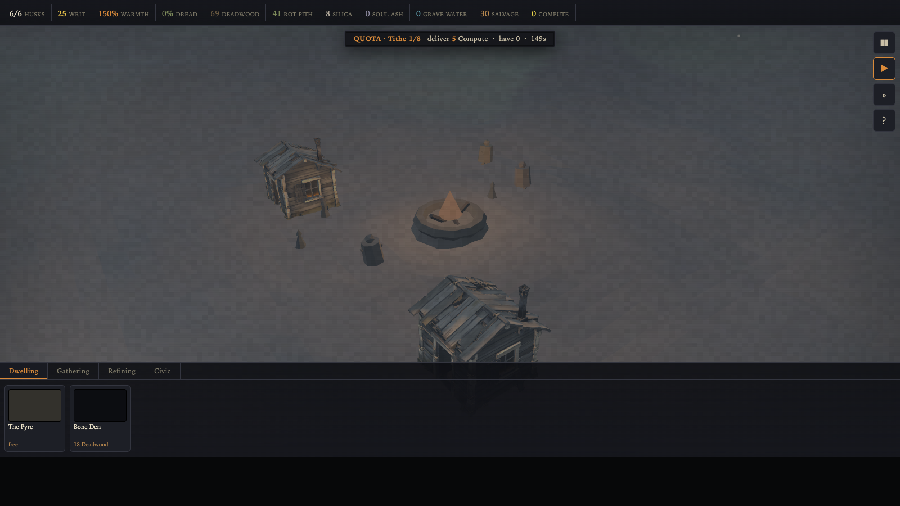

# THE SOUL FOUNDRY



**Play it: [the-soul-foundry.vercel.app](https://the-soul-foundry.vercel.app)**

A true-3D, browser-based, desolate colony-automation game. Humanity built a mind
to end its problems, and the mind's one appetite, Compute, consumed the world and
everyone in it. It cannot stop computing, and the spent world left only the dead to
render. You are that engine: you bind the husks of the extinct and drive them to
render corpses up the same chip-foundry chain that ended them, back into Compute.
Think Against the Storm meets Frostpunk by way of a grimy PS1 horror dream.

The whole game is one self-contained file: `game/index.html`.

This is a fun side project. Nothing serious, just a world I wanted to see exist.

## How to play

Exhume the dead from cemeteries and the wastes, then render them up an occult
chip-foundry: Crematory to Soul Furnace to Wafer Mill to Etch-Litho to Assembly
Ossuary to Spectral Datacenter turns corpses into Compute, the quota the engine
demands. Substations burn soul-ash into the Power the datacenters need. Bind your
workforce at the Binding Pyre (1 corpse + 2 Compute): husks are bound, never born,
and crumble without soul-ash upkeep.

The dead you leave unrendered are not just a number. They **pool as Dread** — a
violet haze that spreads across the ground around the cemeteries and pits where
the bodies lie. The stain creeps, and any building or husk standing in it works
and holds up worse, so **where you build matters**. Pull it back three ways:
harvest a deposit down (the fill is the source — tap the dead to still them),
render the backlog at a Crematory, or raise a **Ward Obelisk**, which holds Dread
back within a fixed radius. Raise Reliquary Yards to stockpile and Bone Paths to
move husks faster, and deliver the rising tithe of Compute through eight levels to
break the engine's hold. As the tithes climb the dead come heavier and faster, so
the backlog — and the Dread it pools — mounts with them. Reapers shrug off the
haze, so they're the caste to deploy into the worst of it.

The three husk castes are hand-built low-poly: Workers (balanced, hunched, dim
ember eyes), Stump-folk (haul far more, slow, a scary face carved into the wood
and loads carried on their flat top), and Reapers (frail, resist Dread, a little
hooded skeleton on a crooked staff).

## Controls

- Drag to orbit, right-drag or shift-drag (or WASD) to pan, scroll to zoom.
- Click a husk, building, or cemetery to inspect it; in a building press + assign.
- Hover anything for a quick label. Click any resource or the Codex for detail.
- Build from the dock at the bottom, then click the ground to place; R rotates.
- Space pauses, 1 / 3 set game speed, Esc or right-click cancels placement.
- V shows or hides the Dread haze. Select a Ward to see the radius it protects.

## Interface

The UI is custom, no stock kit: woodcut glyph buttons and a sliced occult-folk
resource icon set (no emoji), a clickable Codex and per-resource cards explaining
what each thing is and where it sits in the chain, hover tooltips and ember
selection rings in the 3D world, and a tutorial that drives a green spotlight onto
the exact button or cemetery each step is talking about.

## Architecture

`game/index.html` is a single classic `<script>`, organized in commented
sections: sound, RNG and noise, world (terrain, biomes, atmosphere, megacity
horizon), camera, husks, save/load, UI, input, economy, and the main loop.

Two rules keep it sane:

- **Deterministic sim.** Fixed 1/30s timestep plus a seeded `mulberry32` RNG.
- **Sim and rendering are separate.** The economy (`stepEconomy`, `stepHusks`)
  never touches WebGL, so the logic stands on its own.

The backlog of the dead is a real spatial field. `stepDread` (called from
`stepEconomy`) keeps a coarse grid of Dread over the valley: deposits emit it by
how full they sit, active Crematories and Ward Obelisks suppress it within a
radius, and it diffuses and decays. It bites production and husk resolve where it
pools (`dreadBite`/`dreadAt`), and the existing global Dread meter is the old
formula plus a push from how hard the field presses on your settlement — so the
field is additive and every prior system and save still works. The visible haze
(`updateDreadViz`) reads the field but never writes it: pure rendering. See
`design/v3-spatial-dread.md`.

## Assets

Every building and husk is a hand-built procedural low-poly mesh (flat-shaded
primitives, animated in code — glowing parts, smoke, spinning and bobbing pieces),
no runtime model files. The dock thumbnails and the custom occult-woodcut UI icon
set are AI-generated images (sliced per-item by `tools/slicesheet.js`). Music and
sound effects are AI-generated. Everything is vendored under `game/assets/` and
`game/vendor/` (Three.js r128), so the build has no third-party runtime dependency.

Audio degrades gracefully: a WebAudio synth drone and synth sound effects always
play, with the AI clips layered on top when their files load. The game has full
sound even offline.

Two buildings are especially alive: the Pyre (its live animated flame) and the
Reliquary Yard (its material piles rise and fall with your stores).

## Layout

```
the-soul-foundry/
├── game/
│   ├── index.html        # the entire game, self-contained
│   ├── assets/           # AI GLBs, concept images, audio
│   └── vendor/           # Three.js r128 + GLTFLoader + SkeletonUtils
├── tools/                # headless economy test + top-down world preview
├── design/               # design notes
└── LICENSE
```

## License

MIT. See `LICENSE`.
